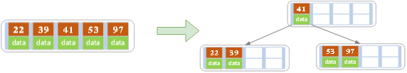
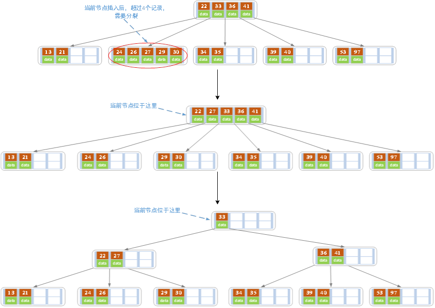
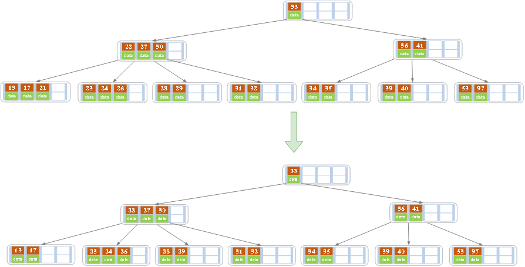
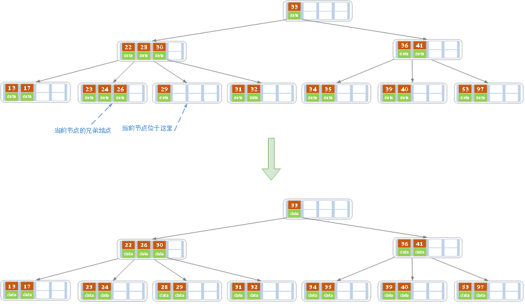
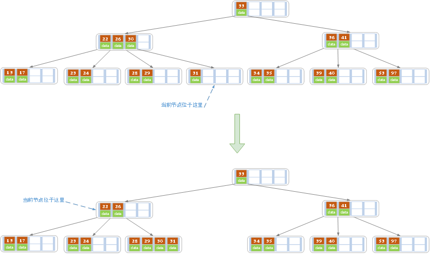
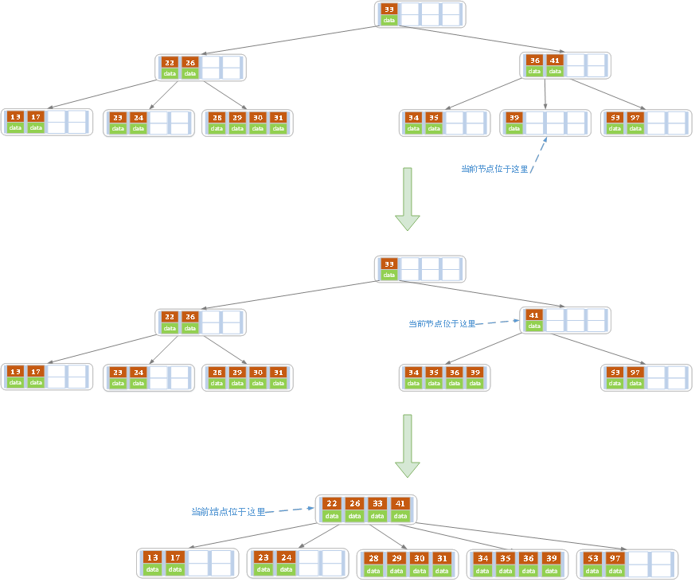

[TOC]

## 1 B-树的性质
&emsp;&emsp;B树（B-树）是一颗多路平衡查找树。我们描述一颗 B 树时需要指定它的阶数，阶数表示了一个结点最多有多少个孩子结点，一般用字母 m 表示阶数，当 m 为 2 时这颗树为二叉搜索树。一颗 m 阶的 B 树定义如下：
- 每个结点最多有 m-1 个关键字。
- 根结点最少可以只有一个关键字。
- 非根结点至少有 `math.Ceil(m/2)-1` 个关键字。
- 每个结点中的关键字都按照从小到大的顺序排列，每个关键字的左子树中的所有关键字都小于它，而右子树的所有关键字都大于它。
- 所有的叶子结点都在同一层。即根节点到每个关键字的路径长度相等。

## 2 插入操作
&emsp;&emsp;插入操作是指插入一条记录，即（key, value）的键值对。如果 B 树中存在要插入的键值对，则用需要插入的 value 替换旧的 value。若不存在，则一定实在叶子结点进行插入操作。
 

**插入步骤如下：**
1. 找到插入点。
1. 判断当前结点的 key 的个数是否小于等于 m-1，若满足则结束，否则进行第 **3** 步。
1. 以结点中间的 key 为中心分裂成左右两部分，然后将中间这个 key 放入父节点中，这个 key 的左子树为结点的左半部分，右子树为结点的右半部分。当前结点指向父节点，继续进行第 **3** 步。

### 2.1 插入示例
&emsp;&emsp;下面以 5 阶 B 树为例，介绍 B 树的插入操作，在 5 阶 B 树中，结点最多有 4 个 key，最少有 2 个 key（普通结点）。根节点最少 1 个 key。

 
 

&emsp;&emsp;在空树中插入39，满足 B 树性质，操作结束。
 

&emsp;&emsp;插入22、41、97，此时根节点存在 4 个 key，满足 B 树性质，操作结束。
 

&emsp;&emsp;插入53，此时结点 key 的个数超过了 4 个，以 41 为中心进行分裂，41 提升到父节点。当前节点指向父节点，发现满足 B 树性质，操作结束。
 

&emsp;&emsp;插入27，此时结点 key 的个数超过了 4 个，以 27 为中心进行分裂，27 提升到父节点。当前节点指向父节点，发现 key 的个数也超过了 4 个，继续以 33 为中心进行分裂，33 提升到父节点。当前节点指向父节点，发现满足 B 树性质，操作结束。

## 3 删除操作
&emsp;&emsp;删除操作是指，根据 key 删除记录，如果B树中的记录中不存对应key的记录，则删除失败。
 

**删除步骤如下：**
1. 如果当前删除的 key 位于非叶子结点，则用后继结点对应的 key 覆盖要删除的 key，然后删除后继结点对应的 key。
1. 删除结点 key 的个数大于 `math.Ceil(m/2)-1`，结束删除操作，否则执行**步骤3**。
1. 找到 key 的个数大于 `math.Ceil(m/2)-1` 的兄弟结点，父结点中的 key 下移到删除结点，兄弟结点的 key 上移到父结点。若找不到，则将父节点对应的 key 下移到删除结点并于删除结点的兄弟结点进行合并（同源的兄弟结点）形成新的结点。当前结点指向新节点的父结点，继续进行**步骤2**。

### 3.1 删除示例

&emsp;&emsp;删除21，删除结点 key 的个数大于2，满足 B 树性质，删除操作结束。
 

&emsp;&emsp;继续删除28，删除结点 key 的个数小于2。找到 key 的个数大于 2 的兄弟结点，将 26 上移到父结点，并将父结点的 30 下移到删除结点。删除操作结束。
 

&emsp;&emsp;继续删除32，删除结点 key 的个数小于2。删除结点的兄弟结点 key 的个数都不大于2，因此将父结点的 30 下移到删除结点，并将删除结点的兄弟结点与自身进行合并形成新的结点。当前结点指向新结点的父结点，父结点 key 的个数大于1，删除结束。
 

&emsp;&emsp;继续删除40，删除结点 key 的个数小于2。删除结点的兄弟结点 key 的个数都不大于2，因此将父结点的 36 下移到删除结点，并将删除结点的兄弟结点与自身进行合并形成新的结点。当前结点指向新结点的父结点，父结点 key 的个数小于2，继续重复**步骤2**，最终得到最后一个图。