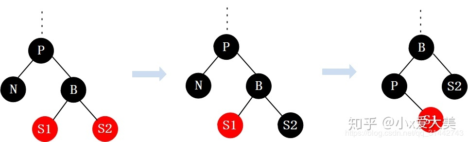
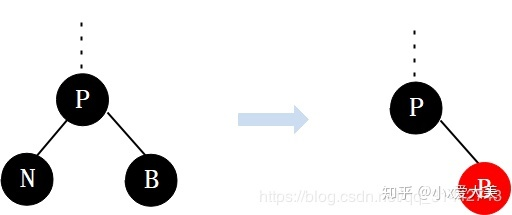

[TOC]

## 1 红黑树的性质
1. 节点要么是红色，要么是黑色。
1. 根节点是黑色的。
1. 每个叶节点（nil或空节点）是黑色的。
1. 每个红色节点的两个子节点是黑色的（相邻的两个节点不能是红色）。
1. 从任何一个节点到其每个叶子节点的所有路径经过的黑色节点个数相同。这里有几个定义：从根节点到某个节点所经过的黑色节点的数目成为这个节点的 `black depth` ；从根节点到叶子节点所经过的黑色节点数目成为这个树的 `black-height` 。

## 2 节点插入
**红黑树的插入总体分为7中情况：**
- 插入的节点是根节点。
- 插入的节点的父节点是黑色。
- 插入的节点的父节点是红色，叔叔节点也是红色。
- 插入的节点的父节点是红色，叔叔节点是黑色(或没有 因为nil为黑色节点)。
    - 左左插入。
    - 左右插入。
    - 右右插入。
    - 右左插入。

### 2.1 插入的节点是根节点
直接将节点变为黑色。

### 2.2 插入的节点的父节点是黑色
直接插入。

### 2.3 插入的节点的父节点是红色，叔叔节点也是红色

插入节点 N 的父节点是红色（节点 P 为红色，其父节点必然为黑色），叔叔节点 U 也是红色。由于 P 和 N 均为红色需要进行调整。这种情况下先将 P 和 U 的颜色染成黑色，再将 G 的颜色染成红色。此时 G 经过的路径上黑色节点的数量不变。注意 G 变为红色后，可能会和他的父节点形成连续的红色节点，此时需要递归向上处理。

### 2.4 插入的节点的父节点是红色，叔叔节点是黑色(或没有 因为nil为黑色节点)
#### 2.4.1 左左

插入节点 N 的父节点为红色，叔叔节点为黑色。N 是 P 的左孩子，且节点 P 是 G 的左孩子。此时对 G 进行右旋，调整 P 和 G 的位置，并互换颜色。

#### 2.4.2 左右

插入节点 N 的父节点为红色，叔叔节点为黑色。节点 N 是 P 的右孩子，且节点 P 是 G 的左孩子。此时先对节点 P 进行左旋，调整完后，**左右**情况就转换成了**左左**情况。进而继续使用**左左**的方法继续调整。

#### 2.4.3 右右

插入节点 N 的父节点为红色，叔叔节点为黑色。N 是 P 的右孩子，且节点 P 是 G 的右孩子。此时对 G 进行左旋，调整 P 和 G 的位置，并互换颜色。

#### 2.4.4 右左

插入节点 N 的父节点为红色，叔叔节点为黑色。节点 N 是 P 的左孩子，且节点 P 是 G 的右孩子。此时先对节点 P 进行右旋，调整完后，**右左**情况就转换成了**右右**情况。进而继续使用**右右**的方法继续调整。

## 3 节点删除（删除左子树上的节点）
1. 删除的是叶子节点且该叶子节点是红色的（无需修复）。
1. 删除的是叶子节点且该叶子节点是黑色的（破坏特性5，需要修复）。
1. 删除的节点 P 下面有一个子节点 S ，对于这种情况先将 P 和 S 的值进行互换，再删除 S ，这样 **3** 这种情况就转换为了 **1** 或 **2** 情况：
    - P 为黑色，S 为红色（对应 **1**）。
    - P 为黑色或红色，S 为黑色（对应 **2**）。
1. 删除的节点 P 下面有两个子节点，对于这种情况，我们通过将P和它的后继节点 N 的值交换的方 式，将删除节点 P 转换为删除后继节点 N ，而后继节点只可能是以下两种情况：
    - N 是叶子节点（对应 **1** 或 **2**）。
    - N 有一个子节点（对应 **3**）。

**示例：**

- 假设删除 3，该节点为红色且为叶子节点，对应 **1**，无需修复。
- 假设删除 1，该节点为黑色且为叶子节点，对应 **2**，需要修复。
- 假设删除 9，对应 **3**，这个时候只要将 9 和 10 的值进行互换，再删除 10。
- 假设删除 6，对应 **4**，这个时候只要将 6 和 7 的值进行互换，再删除 7。当然后继节点 7 可能存在一个孩子节点，这样就转变为了 **3** 这种情况。

所以我们发现，无论多复杂的情况，都可以转化为删除叶子节点，而删除红叶色节点不需要修改红黑树，而修改黑色叶子节点需要修改红黑树，因此我们重点讨论删除叶子节点是黑色的情况。

### 3.1 删除节点的兄弟节点为黑色（删除 N，nil为黑色节点）
#### 3.1.1 兄弟节点有一个右孩子（为满足性质5 一定为红色）

3.1.1 可以分两种情况，处理方式一样。
1. 将父节点的颜色赋给兄弟节点。
1. 将父节点和兄弟的右孩子节点置为黑色。
1. 对父节点进行左旋。

右子树删除相当于 3.1.2 的镜像处理。

#### 3.1.2 兄弟节点有一个左孩子（一定为红色）

3.1.2 可以分两种情况，处理方式一样。
1. 将兄弟的左孩子置为黑色。
1. 将兄弟节点置为红色。
1. 对兄弟节点进行右旋。
1. 经过上述步骤后转换为了 **3.1.1** 情况。

右子树删除相当于 3.1.1 的镜像处理。

#### 3.1.3 兄弟节点有两个孩子（一定为红色）

3.1.3 可以分两种情况，处理方式一样。（注：与 3.1.1 的处理方式类似）
1. 将父节点颜色赋给兄弟节点。
1. 将兄弟节点的右孩子置为黑色。
1. 将父节点置为黑色。
1. 对父节点进行左旋。

右子树删除相当于镜像处理。

#### 3.1.4 兄弟节点没有孩子节点（或没有）

3.1.4 可以分两种情况，处理方式一样。
1. 将兄弟节点置为红色
1. 将父节点置为黑色。

右子树删除相当于镜像处理。

### 3.2 删除节点的兄弟节点是红色

1. 将兄弟节点设置为黑色。
1. 将兄弟节点的左孩子设置为红色。
1. 对父节点进行左旋。

右子树删除相当于镜像处理。